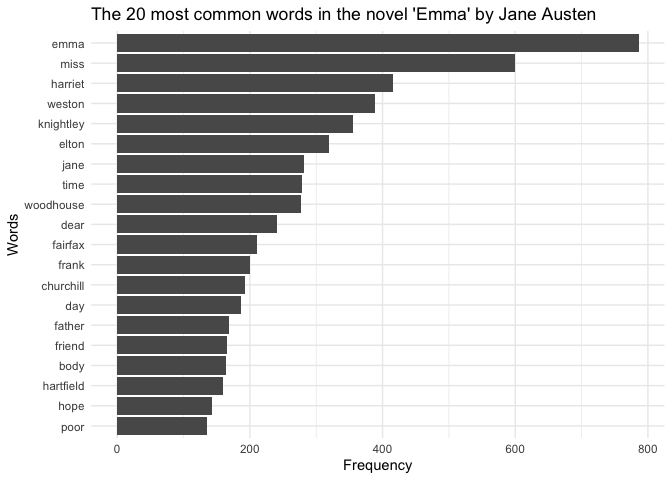

Assignment B4: Option A
================

I have chosen option A for assignment B4. To accomplish the tasks in
this assignment, several R packages are loaded, each providing specific
functionalities.

``` r
library(tidyverse)
library(janeaustenr)
library(tidytext)
library(ggplot2)
library(testthat)
```

### Exercise 1

In this exercise, I analyze Jane Austen’s novel “Emma” using the
`janeaustenr` and `tidytext` packages to identify and explore the 20
most common words in the novel, excluding stopwords.

### R Packages Used:

- `janeaustenr`: Provides the complete texts of Jane Austen’s novels in
  a format ready for text analysis. I selected the book “Emma” from this
  package for my analysis.  
  Source: [janeaustenr on
  CRAN](https://cran.r-project.org/package=janeaustenr)
- `tidytext`: Enables text mining with a tidy data frame approach. It
  offers tools for tokenization and removing stopwords, which are
  essential for this analysis.  
  Source: [tidytext on
  CRAN](https://cran.r-project.org/package=tidytext)

``` r
#Load the book "Emma" from janeaustenr
book <- austen_books() %>%
  filter(book == "Emma")

#Tokenize the text into individual words
book_words <- book %>%
  unnest_tokens(word, text)

#Remove stopwords using tidytext's built-in stopword list
cleaned_words <- book_words %>%
  anti_join(stop_words, by = "word")

#Count the most frequent words in the cleaned text
word_counts <- cleaned_words %>%
  count(word, sort = TRUE)
```

Next, the 20 most common words, excluding stopwords, are plotted to
inspect the frequency in the novel “Emma”.

``` r
#Plot of the top 20 words
word_counts %>%
  slice_max(n, n = 20) %>%
  ggplot(aes(x = reorder(word, n), y = n)) +
  geom_col() +
  coord_flip() +
  labs(
    title = "The 20 most common words in the novel 'Emma' by Jane Austen",
    x = "Words",
    y = "Frequency"
  ) +
  theme_minimal()
```

<!-- -->

This bar chart shows the 20 most common words in Jane Austen’s novel
“Emma”, excluding stopwords. The names “Emma,” “Miss,” and “Harriet” are
the 3 most dominating, highlighting the central characters and themes in
the novel, which revolve around personal relationships, social
hierarchies, and interpersonal dynamics.

### Exercise 2

In this exercise, I create a custom function to convert a word into a
modified version of Pig Latin. The function is tested using examples and
formal test cases to ensure it behaves as expected.

#### Creation of function

The function `convert_to_pig_latin` takes a single word as input and
applies the following rules:

- If the word starts with a vowel (a, e, i, o, u), the first letter is
  moved to the end.
- If the word starts with a consonant, the word is reversed.
- In both cases, the string *545STAT* is appended to the end.

Additionally, the function includes error handling to ensure only valid
inputs are processed.

``` r
#' Convert words to custom Pig Latin
#' 
#' This function takes a word and converts it into a custom Pig Latin format following the rules stated under details.
#'
#' @param word A string representing the input word to be converted.
#' @return A string representing the word in custom Pig Latin format.
#' 
#' @details The custom Pig Latin rules implemented in the function are the following:
#' - If the word starts with a vowel (a, e, i, o, u), the first letter is moved to the end.
#' - If the word starts with a consonant, the entire word is reversed.
#' - After the rearrangement, "545STAT" is appended at the end.
#' 
#' @examples
#' convert_to_pig_latin("apple")  #Returns "pplea545STAT"
#' convert_to_pig_latin("banana") #Returns "ananab545STAT"
#' convert_to_pig_latin("egg")    #Returns "gge545STAT"
#'
#' @export
convert_to_pig_latin <- function(word) {
  if (!is.character(word) || length(word) != 1) {
    stop("Input must be a single string.")
  }
  vowels <- c("a", "e", "i", "o", "u")
  first_char <- substr(word, 1, 1)
  
  if (tolower(first_char) %in% vowels) {
    modified_word <- str_c(substr(word, 2, nchar(word)), first_char)
  } else {
    modified_word <- str_c(rev(strsplit(word, "")[[1]]), collapse = "")
  }
  
  pig_latin_word <- str_c(modified_word, "545STAT") 
  return(pig_latin_word)
}
```

#### Examples of function

Here, I demonstrate the `convert_to_pig_latin` function with examples to
show how it handles different inputs.

``` r
#Examples
convert_to_pig_latin("apple")  # "pplea545STAT"
```

    ## [1] "pplea545STAT"

``` r
convert_to_pig_latin("banana") # "ananab545STAT"
```

    ## [1] "ananab545STAT"

``` r
convert_to_pig_latin("egg")    # "gge545STAT"
```

    ## [1] "gge545STAT"

``` r
convert_to_pig_latin("test")   # "tset545STAT"
```

    ## [1] "tset545STAT"

#### Test of function

Finally, I perform formal tests on the `convert_to_pig_latin` function
using the `testthat` package. These tests evaluate the function under
various conditions to ensure it behaves as expected. Specifically, the
tests check how the function handles single characters, edge cases (such
as empty strings, strings containing numbers, and strings with special
characters), and scenarios where the function is expected to throw an
error with the message: “Input must be a single string.”

``` r
test_that("convert_to_custom_pig_latin handles single characters", {
  expect_equal(convert_to_pig_latin("a"), "a545STAT")           
  expect_equal(convert_to_pig_latin("z"), "z545STAT")           
})
```

    ## Test passed 🎉

``` r
test_that("convert_to_custom_pig_latin handles edge cases", {
  expect_equal(convert_to_pig_latin(""), "545STAT")              
  expect_equal(convert_to_pig_latin("12345"), "54321545STAT")   
  expect_equal(convert_to_pig_latin("!@#$"), "$#@!545STAT")
})
```

    ## Test passed 😀

``` r
test_that("convert_to_custom_pig_latin throws an error for invalid inputs", {
  expect_error(convert_to_pig_latin(NULL), "Input must be a single string.")
  expect_error(convert_to_pig_latin(123), "Input must be a single string.")
  expect_error(convert_to_pig_latin(c("apple", "banana")), "Input must be a single string.")
})
```

    ## Test passed 😀
